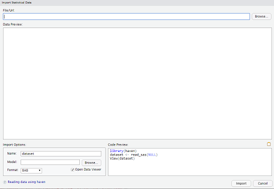
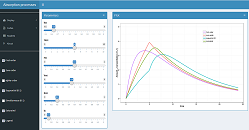
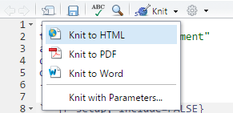

<style type="text/css">

slides > slide:before {
  font-size: 12pt;
  content: 'http://shiny.rstudio.com/';
  position: absolute;
  text-align: center;
  bottom: 15px;
  left: 50%;  
  margin-left: -300px;
  width: 600px;
  line-height: 1.9;
}

div.img-col{
  text-align: center;
  font-size: 14pt;
}

a {
  border-bottom: none !important;
}

.wrapper {
  margin: 70px auto;
  position: relative;
  z-index: 90;
}

.ribbon-wrapper-green {
  width: 145px;
  height: 148px;
  overflow: hidden;
  position: absolute;
  top: -3px;
  right: -3px;
}

.ribbon-green {
  font: bold 15px Sans-Serif;
  color: #333;
  text-align: center;
  text-shadow: rgba(255,255,255,0.5) 0px 1px 0px;
  -webkit-transform: rotate(45deg);
  -moz-transform:    rotate(45deg);
  -ms-transform:     rotate(45deg);
  -o-transform:      rotate(45deg);
  position: relative;
  padding: 7px 0;
  left: -25px;
  top: 45px;
  width: 220px;
  background-color: #7ADCBF;
  background-image: -webkit-gradient(linear, left top, left bottom, from(#8AACDF), to(#658FBE)); 
  background-image: -webkit-linear-gradient(top, #8AACDF, #658FBE); 
  background-image:    -moz-linear-gradient(top, #8AACDF, #658FBE); 
  background-image:     -ms-linear-gradient(top, #8AACDF, #658FBE); 
  background-image:      -o-linear-gradient(top, #8AACDF, #658FBE); 
  color: #6a6340;
  -webkit-box-shadow: 0px 0px 3px rgba(0,0,0,0.3);
  -moz-box-shadow:    0px 0px 3px rgba(0,0,0,0.3);
  box-shadow:         0px 0px 3px rgba(0,0,0,0.3);
}

.ribbon-green:before, .ribbon-green:after {
  content: "";
  border-top:   3px solid #00896e;   
  border-left:  3px solid transparent;
  border-right: 3px solid transparent;
  position:absolute;
  bottom: -3px;
}

.ribbon-green:before {
  left: 0;
}
.ribbon-green:after {
  right: 0;
}
</style>

# Overview

## We'll Discuss:
<div class="columns-2">
- Importing data
- Data Step
- Procs
- ODS
- Macro Varibles
- Macros

<div class="img-col">

   
 </div>
</div>

## Where is the Little R Book?

- [http://r4ds.had.co.nz/](http://r4ds.had.co.nz/)

- [http://www.cookbook-r.com/Graphs/](http://www.cookbook-r.com/Graphs/)

## Setup

- R
- Packages
- IDE
- Projects
- Sessions
- Git/Github
- RSC
- Shiny

## IDE PICK A DATASET

- Built-in datasets
- data()
- data(ToothGrowth)
- ?ToothGrowth
- ToothGrowth
- View(ToothGrowth)
- summary(ToothGrowth)
- plot(ToothGrowth)

## IDE LET’S EXPLORE...
- getwd()
- library(tidyverse)
- let us explore the data set a bit
- names(ToothGrowth) # names of the variables
- dim(ToothGrowth) # dimension (number of rows and columns)
- str(ToothGrowth) # structure of the data set
- class(ToothGrowth)
- head(ToothGrowth, n = 5)
- tail(ToothGrowth, n = 5)
- ToothGrowth%>% write_csv('ToothGrowth.csv')
- ToothGrowth2 <-read_csv("ToothGrowth.csv")

## DATATYPES
- R has a wide variety of data types…
- Vectors
- Lists
- Matrix
- Factors
- Data frame
- Tibble

## Key Information

- Built-in loop
- [R applies functions at the column-level](http://rconvert.com/Convert_SAS_To_R_Statistical_Data/wp-content/uploads/2012/06/SAS_to_R_Conversion.pdf)
- Data Sets & Arrays
- R - Tibbles, Data Frame, Vectors, Matrices, Lists, Arrays
- Objects
- R Memory Usage
- Hard Drive

## Interesting

- https://www.precision-analytics.ca/blog-1/sas-to-r
- https://community.rstudio.com/t/sas-vs-r-discussion-prep/2665/2
- https://www.mango-solutions.com/blog/sasmap-static-code-analysis-for-sas

## Getting Started

- [Cran](https://cran.r-project.org/) & Base - Review/vetting process
- Logs
- Viewing Results
 - Viewtable
 - Explorer
- Data Libraries
- R Home Directory
- Temp vs. Permanent Data Sets
- Variables

## Viewing the Data as a Spreadsheet

- https://rpubs.com/ysohn/compass01_spring_2017
- Let's look at our data in more depth!
- Let's use the function View()
- Try this R Code: View(States)
- We can also view a data set in the RConsole directly
- R functions: print(), head(), tail(), str(),dim(), nrow(), rownames(), colnames() ncol()
- We can also show them in the R console: ls()
- How to remove a variable or data set: rm()

## Hopefully Not in this room...

<div class="columns-4"></a>

</div>

# Importing Data

## Datalines

```{r, message=FALSE}
library(tibble)
#library("tidyverse")
storms <-tribble(
~storm, ~wind, ~pressure, ~date,
"Alberto", 110, 1007, "2000-08-12",
"Alex", 45, 1009, "1998-07-30",
"Allison", 65, 1005, "1995-06-04",
"Ana", 40, 1013, "1997-07-01",
"Arlene", 50, 1010, "1999-06-13",
"Arthur", 45, 1010, "1996-06-21"
)

# filter(storms, wind == 45)

# data person;
#   input name $ dept $;
#   datalines;
# John Sales
# Mary Acctng
# ;
```

## Importing Data

- Infile
- feather - a fast, lightweight file format used by both R and Python
- readr - reads tabular data
- readxl - reads Microsoft Excel spreadsheets
- [haven - reads SAS, SPSS, and Stata files](http://www.principlesofeconometrics.com/sas.htm)
- sas7bdat package & foreign package
- DBI - a universal interface to database management systems (DBMS)
- dplyr - contains an interface to common databases
- [data.table - fread() for fast table reading](https://rpubs.com/ggData/datatable)
- XPT files can be read into R with the built-in read.xport
- [SASxport](http://blog.revolutionanalytics.com/2017/06/r-fda.html), rio

## R for Data Science
- [http://r4ds.had.co.nz/](http://r4ds.had.co.nz/)
- [tidyverse](https://blog.rstudio.org/2016/09/15/tidyverse-1-0-0/)
- https://github.com/rstudio/RStartHere

## Preview - Importing Data
<div class="columns-2">

- Tabular
- Distributed
 
  <div class="img-col">
   
   
 </div>
</div>

## Data Sets

- http://www.principlesofeconometrics.com/sas.htm

- https://rpubs.com/williamsurles/290693

## Tabular
- Demo

## Import Dataset Menu

<div class="columns-2">
- Easy to use
- Writes code

<div class="img-col">

   
 </div>
</div>

## Distributed Sources
- CSV goes to memory but... as data groww, intro Relational Model...
- Big Data - doesn't fit into a single, few machines
- 100, 1000s of nodes (computers)
- Spark
- HDFS
- Or Sampling

## Hadoop...It is often common to put RStudio Server on the edge nodes.

- http://spark.rstudio.com/guides/data-lakes/
- http://spark.rstudio.com/examples/cloudera-aws/
- http://spark.rstudio.com/examples/yarn-cluster-emr/
- http://spark.rstudio.com/examples/stand-alone-aws/
- http://db.rstudio.com/databases/hive/
- http://db.rstudio.com/databases/impala/
- http://db.rstudio.com/rstudio/connections

# Working with Your Data, Modifying & Sorting, Combining R Data Sets, SQL - Data Step

## Comparison

- Data Step, Procs, Macros, Macro Varibles, ODS
- Tidyverse, Packages, Functions, Parameterized RMD, RMD
- ["The philosophy of dplyr reminds me a lot the way the SAS Data Step works, although they are syntactically different they are quite similar in terms of data manipulation." ](http://altons.github.io/rstats/2015/01/22/an-easy-way-of-installing-rpostgresql-on-mac/)
- ["For managing the data there are a few really popular packages: dplyr and data.table" ](http://stats.stackexchange.com/questions/123274/from-sas-to-r-what-are-must-packages-for-reporting)
- [tidyverse](https://blog.rstudio.org/2016/09/15/tidyverse-1-0-0/)
- [Over the last year I have changed my data processing and manipulation workflow in R dramatically. Thanks to some great new packages like dplyr, tidyr and magrittr (as well as the less-new ggplot2) I've been able to streamline code and speed up processing.](http://zevross.com/blog/2015/01/13/a-new-data-processing-workflow-for-r-dplyr-magrittr-tidyr-ggplot2/)

## Data Step/Management

- [tidyverse](https://rpubs.com/bradleyboehmke/data_wrangling)
- [dplyr](https://rpubs.com/justmarkham/dplyr-tutorial)
- [data.tables](https://rpubs.com/carbonmetrics/datatable)
- Dates - lubridate
- Set Statement <- & %>%
- Subsetting
- https://rpubs.com/hgil01/Modern-R-for-SAS-Users
- https://www.computerworld.com/article/2921176/business-intelligence/great-r-packages-for-data-import-wrangling-visualization.html

## See Slides

- https://rpubs.com/cogent_himanshu/Blog2

- https://sw23993.wordpress.com/2017/07/10/useful-dplyr-functions-wexamples/

- http://colorado.rstudio.com/rsc/content/678/tidyverse_notebook.nb.html

```{r}
trilogies <- c(
  "Prequels: Episode I-III", 
  "Originals: Episode IV-VI", 
  "Sequels: Episode VII"
  )
```

# Databases SQL

## Databases - Connect R to	yourdata

- Explore your databases using the RStudio IDE
- Develop and deploy Shiny applications	that connect on databases
- Learn best practices for using R with	your databases
- Connection	Wizard
- Connections	Tab
- https://blog.rstudio.com/2017/08/16/rstudio-preview-connections/

## Landscape

- DBI
- dplyr
- dbplyr [New!]
- odbc [New!]
- http://db.rstudio.com/

## DB - Three	ways to write	queries
- DBI	code
- dplyr syntax
- R	Notebook	SQL	language	engine

## DB Examples
- 1_DB_Examples
- https://rviews.rstudio.com/2017/10/18/database-queries-with-r/
- https://community.rstudio.com/t/why-does-rstudio-documentation-recommend-odbc-vs-jdbc-drivers/2381/5

# Printing, Summarizing Your Data, Visualizing Your Data - Procs

## Procs

- Proc Print, Means, Freq, Tabulate, Report
- Packages
- https://github.com/rstudio/RStartHere
- http://moderndive.com/2-getting-started.html#packages

## There are several packages that can be used to make very nice tables:

- [printr](https://yihui.name/printr/)
- [xtable](https://cran.r-project.org/web/packages/xtable/vignettes/xtableGallery.pdf)
- [stargazer](https://cran.r-project.org/web/packages/stargazer/vignettes/stargazer.pdf)
- [tables](https://cran.r-project.org/web/packages/tables/vignettes/tables.pdf)
- [pander](http://rapporter.github.io/pander/)
- http://blogs.reed.edu/ed-tech/2015/10/creating-nice-tables-using-r-markdown/

## Common Reporting Tasks - ggplot2

<div class="columns-2">
- [...it took me about an hour to learn the basics of ggplot2](https://www.precision-analytics.ca/blog-1/sas-to-r)
- [Plotting system for R](https://rpubs.com/hadley/ggplot2-toolbox)
- [Created by Hadley Wickham](http://ggplot2.org/)
- [Powerful graphics language for creating elegant and complex plots](http://www.cookbook-r.com/Graphs/)
- [ggplot2 is a graphing library for R. Use ggplot2 with Plotly to create interactive, online ggplot2 charts with D3.js.](https://plot.ly/ggplot2/)
- [ggvis is a data visualization package for R](http://ggvis.rstudio.com/)

<div class="img-col">
<a href="https://ramnathv.github.io/pycon2014-r/visualize/ggplot2.html"></a>

</div>

## A ggplot2 template - Make any plot by filling in the parameters of this template

```{r}
#ggplot(data = <DATA>) +
#<GEOM_FUNCTION>(mapping = aes(<MAPPINGS>))
```

```{r fig.height = 3, fig.width = 5}
library(ggplot2)
ggplot(data = mpg) +
geom_point(mapping = aes(x = displ, y = hwy))
```

# HTML Widgets

## Live HTML Widgets Examples

<div class="columns-2">
- [Institute for Quantitative Social Science - statistical analysis of genomic data for antibiotic resistant strains of mycobacterium tuberculosis by Amanda Winburn and others](https://hmdc.shinyapps.io/genTB/)
- [Best & Worst California Hospitals for Surgery by Gary Chung
](https://gchung.shinyapps.io/CAhospitals/)
- [canvasXpress - developed as the core visualization component for bioinformatics and systems biology analysis at Bristol-Myers Squibb by Isaac Neuhaus
](http://canvasxpress.org/)
- [Visualizing U.S. Clinical Trials
](https://gchung.shinyapps.io/CTgov/)

<div class="img-col">
 </div>

</div>

## HTML Widgets R Bindings to JavaScript Libraries

<div class="columns-2">

- Used at the R console for data analysis just like conventional R plots (via RStudio Viewer).
- Seamlessly embedded within R Markdown documents and Shiny web applications.
- Saved as standalone web pages for ad-hoc sharing via email, Dropbox, etc.

<div class="img-col"><a href="http://www.htmlwidgets.org/showcase_leaflet.html"></a>
 </div>
 
</div>

# Shiny

## Shiny
### About:
 - Interactive web application framework for R
 - Create and share applications with others
 - Expects no knowledge of web technologies like HTML, CSS, or JavaScript (but you can leverage them, if you know them)

### Benefits & Features:
 - Accessible to non-programmers
 - Great for exploratory data analysis, visualizations & dashboards
 - Utilize existing R code
 
## Using Shiny - How to Build a shiny App & Installation & Structure
 - A shiny app consists of two parts: a user interface (UI) and a server
 - Install Package - Shiny - install.packages("shiny")
 - Load Library - Shiny - library(shiny)
 - ui.R - User Interface
 - server.R  - Server Function
 - File Template - runExample("01_hello")
 - [Shiny Cheat Sheet](http://shiny.rstudio.com/articles/cheatsheet.html)
- [Enhance with Shiny functions and R code](http://shiny.rstudio.com/reference/shiny/latest/)
- [Enhance with Shiny Widgets](http://shiny.rstudio.com/gallery/widget-gallery.html)

## Intro Process
 - https://github.com/rstudio/shiny-examples/
 - http://shiny.rstudio.com/gallery/single-file-shiny-app.html
 - Panels
 - ToothGrowth
 - http://shiny.rstudio.com/gallery/basic-datatable.html
 - http://shiny.rstudio.com/gallery/reactivity.html
 
## Shiny Development Example

- 0_Shiny_Datasets
- 0_Shiny_Package

## HTML Widgets &mdash; Leaflet Example - 2_htmlwidgets_Shiny_Leaflet_Starbucks

<div class="columns-2">
<a href="http://www.htmlwidgets.org/index.html"></a>

- How would you add Shiny to it?
- Find Starbuck locations for your hometown...

</div>

## shiny Package & Shiny Server

<table width="100%" style="border-spacing: 50px; border-collapse: separate; margin: -50px auto;">
<tr>
<td style="vertical-align: top; padding-top: 1em">
### shiny Package
Shiny is an open source R package that provides a web framework for building interactive web applications using R.
</td>
<td></td>
</tr><tr>
<td style="vertical-align: top; padding-top: 1em">
### Shiny Server
Shiny Server is a server program that lets you host and manage shiny web applications and interactive documents online.
</td>
<td></td>
</tr>
</table>

# Enhancing Your Output with RMD - ODS

## ODS

- [R Markdown](https://beta.rstudioconnect.com/content/1772/#43)
- Sweave, knitr, LaTeX
- SAS Output Window
- HTML, RTF, PDF, Word Output
- Graphics
  - Proc SGPlot
  - [GGPlot2](https://rpubs.com/hadley/ggplot2-toolbox)
- https://www.ssc.wisc.edu/~hemken/SASworkshops/Markdown/SASmarkdown.html
- http://www.phusewiki.org/docs/2017_SDEs/NorthChicago/Presentations/StefanEnglert.pdf

## Live R Markdown Examples

<div class="columns-2">
- [Cancer prediction using caret by JESUS M. CASTAGNETTO
 ](https://rpubs.com/jesuscastagnetto/caret-knn-cancer-prediction)
- [TCGA prostate cancer differential expression by race
by Levi Waldron
](https://rpubs.com/lwaldron/TCGA_prad)
- [GLMM with various R packages
by Kazuki Yoshida
](https://rpubs.com/kaz_yos/glmm1)
- [A not so short review on 
survival analysis in R](http://rpubs.com/alecri/258589)
- [Access to Hospital Care Dashboard](http://colorado.rstudio.com/rsc/content/154/)
- [Comparative Protein Structure Analysis with Bio3D](http://rpubs.com/xqyao/bio3d_pca)
- [Survival Analysis Example](https://rpubs.com/mjeagle/Surv)

<div class="img-col">
 </div>

</div>

## R Markdown - Benefits & Features

<div class="columns-2">
 - Markdown is a particular type of markup language.
 - Markup languages are designed produce documents from plain text.
 - Existing R code can be used within R Markdown & reports can be parameterized
 - Easy creation of dynamic documents, presentations, and reports
 - Framework for writing reproducible reports from R
 
<div class="img-col">
   
 </div>
</div>

## What can I do with RMD?

- Write a book http://adv-r.had.co.nz/
- Write a blog https://rviews.rstudio.com
- Create a website http://rmarkdown.rstudio.com/
- Add a vignette to a package http://yihui.name/knitr/demo/vignette/
- Publish research https://github.com/rstudio/rticles
- Automate reporting https://github.com/philbowsher/Job-Scheduling-R-Markdown-Reports-via-R
- Preserve your sanity and look back at your workflow

## Using R Markdown - How to Build a Document - Installation & Structure

 - Comes installed with the RStudio IDE
 - File Template - within RStudio
 - ["Add R code - Code Chunks"](http://rmarkdown.rstudio.com/authoring_rcodechunks.html) 
 - 
 - ["R Markdown Cheat Sheet"](http://shiny.rstudio.com/articles/rm-cheatsheet.html) 
 - Enhance with Shiny functions and R code
 - Utilize Chunk Options - echo=FALSE, results="hide", include=FALSE, warning=FALSE & message=FALSE 
 - Global chunk options
 
## Example R Markdown Doc -- `Example.RMD`

- Create a new R Markdown document in the IDE by going to 'File' and select 'New File' and select 'R Markdown...' and create a new document and leave output as HTML
<div class="columns-4"></a> </div>

- Then select Knit and save it as Example.RMD </td>
<td></td>
</tr>
</table>

## rmarkdown::render -- `1_RMD_Stocks`

- rmarkdown::render(“Stocks.Rmd”, params = list(symbol=‘IBM’))
- https://beta.rstudioconnect.com/content/3132/Job_Scheduling_R_Markdown_Reports_via_R.html


# Writing Flexible Code with the RMD parameters, Functions & Packages 

## Macros

- Macro Variables
 - Parameterized Reports - R Markdown
- Macros
 - [Funtions & Funcational Programming](https://rpubs.com/hadley/97970)
 - [Functional Programming](http://www.rpubs.com/ryantillis/R_programming_P1)
 - [Functional Programming](https://rpubs.com/mdancho84/adv-r_functional_programming)
 - https://beta.rstudioconnect.com/content/3130/Conjunction_Junction_whats_your_function_in_R.html

## Additional Resources

 - Shiny Developer Center - http://shiny.rstudio.com
 - [Stack Overflow - "shiny" tag](http://stackoverflow.com/questions/tagged/shiny)
 - ["Shiny Discuss" Mailing List](https://groups.google.com/d/forum/shiny-discuss)
 - ***Come meet us!***
 
## Come see us at the RStudio Conference...

- https://www.rstudio.com/conference/
- Austin, TX January 15th through the 18th

<div class="columns-4"></a>

</div>
